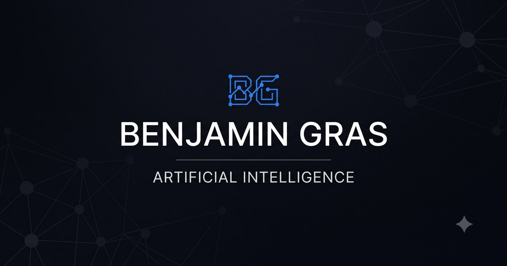

# benj-admin.github.io

My personal site — **[live here](https://benj-admin.github.io)**.



Plain HTML, CSS and JavaScript. No framework, no build step, no backend: what you see is what gets deployed on GitHub Pages.

## What's inside

- **Trilingual** (EN / FR / DE) — all content lives in [js/data.js](js/data.js), the HTML never needs touching.
- **AI Lab** — the retrieval step of a RAG pipeline, running entirely in the browser: [transformers.js](https://github.com/huggingface/transformers.js) loads `Xenova/paraphrase-multilingual-MiniLM-L12-v2`, embeds every passage of the site, and ranks them against your question. Two retrieval strategies to compare: pooled cosine similarity and late interaction (MaxSim). Questions never leave your machine.
- **Quantum Eavesdropper** ([game.html](game.html)) — a mini-game where you play Eve attacking the BB84 protocol, then watch an ε-greedy agent learn the optimal eavesdropping strategy and beat you. A playable spin-off of my QKD research.
- Light/dark theme, cursor glow, a QR code card when printing. The only external resources are Google Fonts and the transformers.js CDN — everything else is vanilla and vendored.

## Run it locally

Any static file server works:

```bash
git clone https://github.com/Benj-admin/Benj-admin.github.io.git
cd Benj-admin.github.io
python3 -m http.server 8000
# open http://localhost:8000
```

The AI Lab downloads its embedding model (~100 MB, cached by the browser) from the Hugging Face CDN on first launch.

## Structure

```
index.html      main page
game.html       Quantum Eavesdropper
js/data.js      all content, in three languages
js/rag.js       AI Lab (embeddings + retrieval)
js/game.js      game logic and the learning agent
js/main.js      rendering, i18n, theme
css/style.css   all styling
```

## License

MIT — see [LICENSE](LICENSE).
